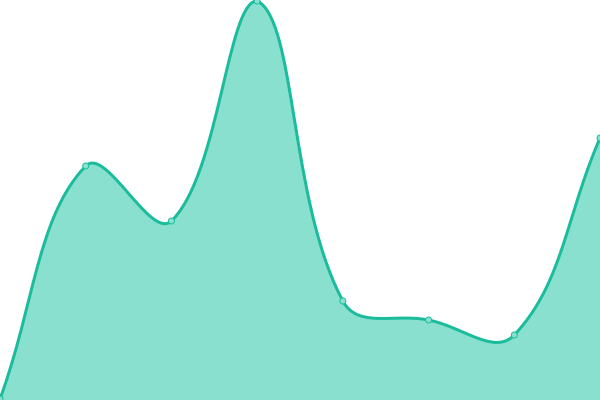
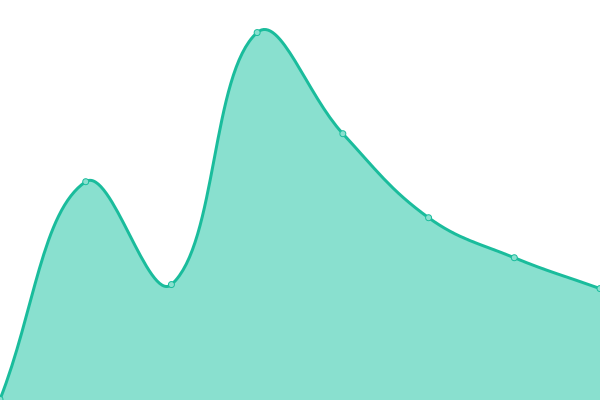
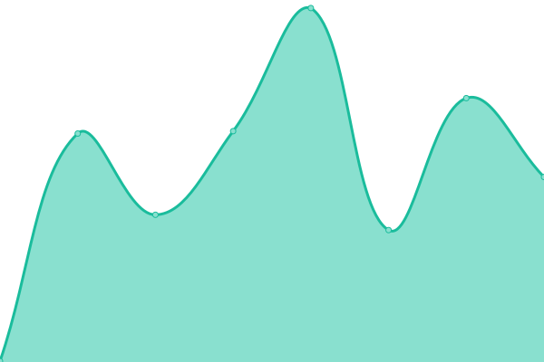
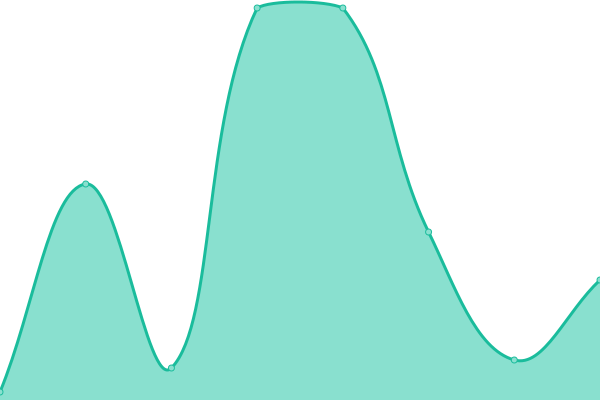

# [📈 Live Status](https://epederson.github.io/Eastbrook-Upptime): <!--live status--> **🟧 Partial outage**

This repository contains the open-source uptime monitor and status page for [Eric](https://epederson.github.io/Eastbrook-Upptime), powered by [Upptime](https://github.com/upptime/upptime).

With [Upptime](https://upptime.js.org), you can get your own unlimited and free uptime monitor and status page, powered entirely by a GitHub repository. We use [Issues](https://github.com/epederson/Eastbrook-Upptime/issues) as incident reports, [Actions](https://github.com/epederson/Eastbrook-Upptime/actions) as uptime monitors, and [Pages](https://epederson.github.io/Eastbrook-Upptime) for the status page.

<!--start: status pages-->
<!-- This summary is generated by Upptime (https://github.com/upptime/upptime) -->
<!-- Do not edit this manually, your changes will be overwritten -->
<!-- prettier-ignore -->
| URL | Status | History | Response Time | Uptime |
| --- | ------ | ------- | ------------- | ------ |
|  Eastbrook Web Site | 🟩 Up | [eastbrook-web-site.yml](https://github.com/epederson/Eastbrook-Upptime/commits/HEAD/history/eastbrook-web-site.yml) | 

 321ms
     
 | 

<a href="https://epederson.github.io/Eastbrook-Upptime/history/eastbrook-web-site">100.00%</a>
    

|  Eastbrook Academy Web Site | 🟩 Up | [eastbrook-academy-web-site.yml](https://github.com/epederson/Eastbrook-Upptime/commits/HEAD/history/eastbrook-academy-web-site.yml) | 

 332ms
     
 | 

<a href="https://epederson.github.io/Eastbrook-Upptime/history/eastbrook-academy-web-site">100.00%</a>
    

|  Asset Management System | 🟩 Up | [asset-management-system.yml](https://github.com/epederson/Eastbrook-Upptime/commits/HEAD/history/asset-management-system.yml) | 

 311ms
     
 | 

<a href="https://epederson.github.io/Eastbrook-Upptime/history/asset-management-system">100.00%</a>
    

|  Help Desk | 🟩 Up | [help-desk.yml](https://github.com/epederson/Eastbrook-Upptime/commits/HEAD/history/help-desk.yml) | 

 228ms
     
 | 

<a href="https://epederson.github.io/Eastbrook-Upptime/history/help-desk">100.00%</a>
    

|  Eastbrook Campus | 🟩 Up | [eastbrook-campus.yml](https://github.com/epederson/Eastbrook-Upptime/commits/HEAD/history/eastbrook-campus.yml) | 

 112ms
     
 | 

<a href="https://epederson.github.io/Eastbrook-Upptime/history/eastbrook-campus">100.00%</a>
    

|  EP | 🟥 Down | [ep.yml](https://github.com/epederson/Eastbrook-Upptime/commits/HEAD/history/ep.yml) | 

 0ms
     
 | 

<a href="https://epederson.github.io/Eastbrook-Upptime/history/ep">0.99%</a>
    

<!--end: status pages-->

[**Visit our status website →**](https://epederson.github.io/Eastbrook-Upptime)

## 📄 License

- Powered by: [Upptime](https://github.com/upptime/upptime)
- Code: [MIT](./LICENSE) © [Eric](https://epederson.github.io/Eastbrook-Upptime)
- Data in the `./history` directory: [Open Database License](https://opendatacommons.org/licenses/odbl/1-0/)
